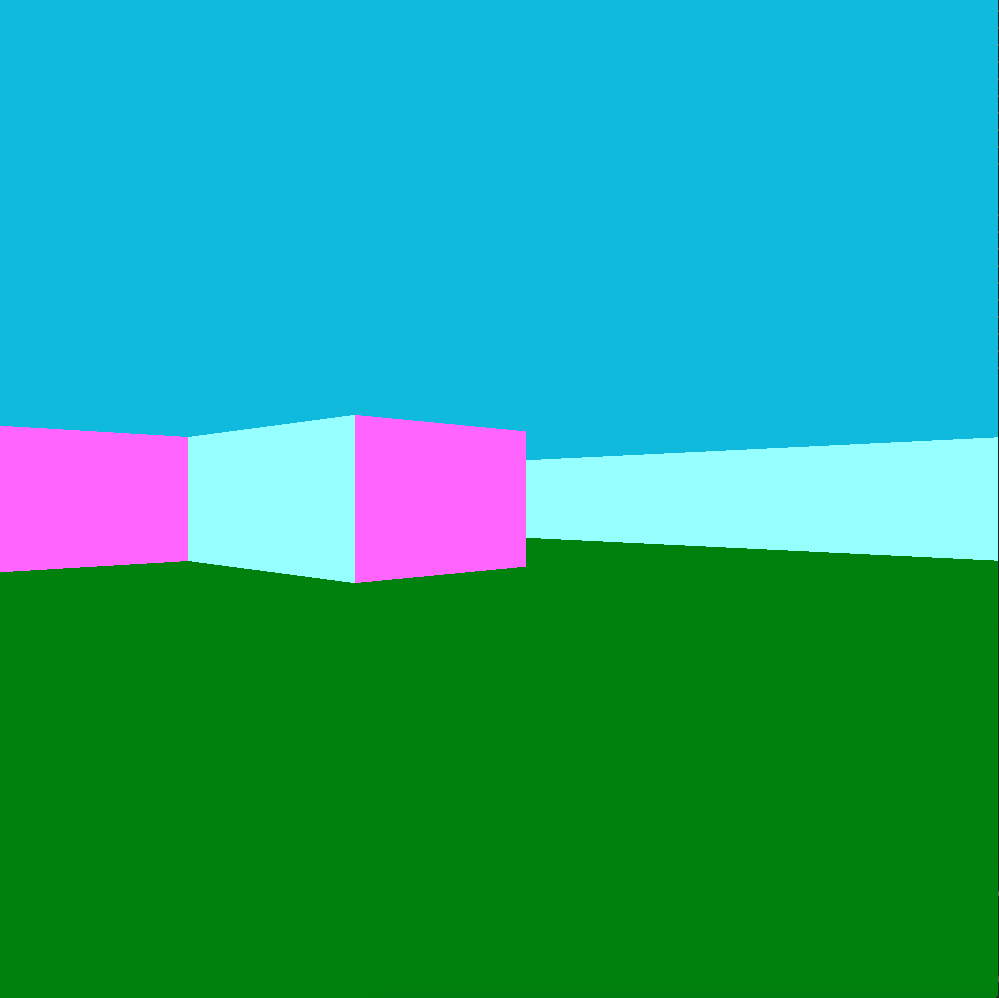
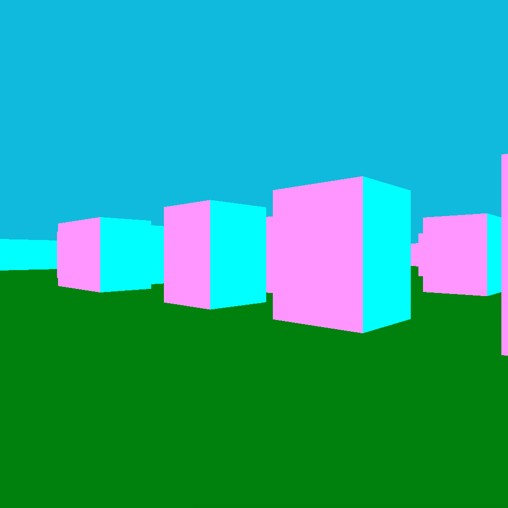

# Wolf3D
2e projet de la branche graphique du [cursus 42](https://www.42.fr).

## Description

Ce projet consiste à modélisé un labyrinthe en fausse 3D basé sur la methode du Ray-Casting.

## Usage

```
$> make
$> ./Wolf3D
```

## Exemples imagés



